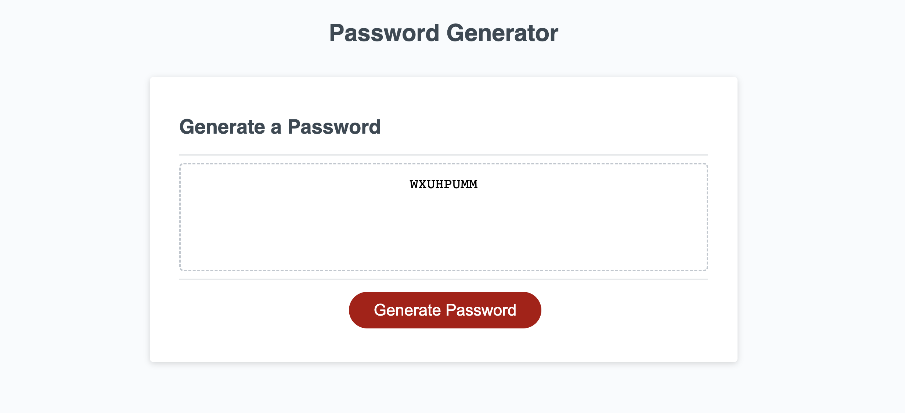
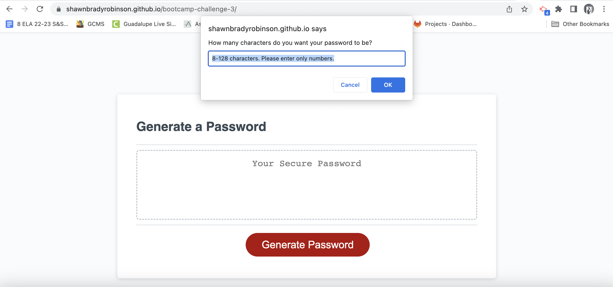
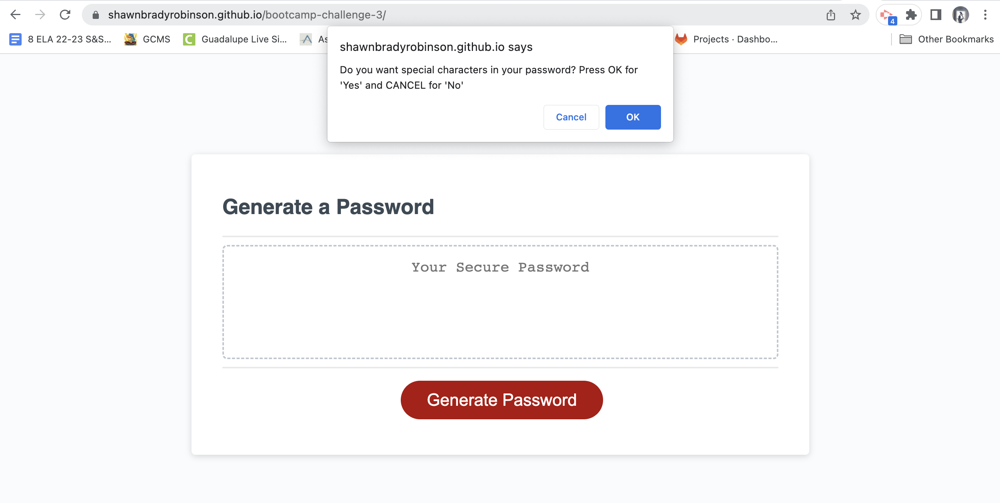
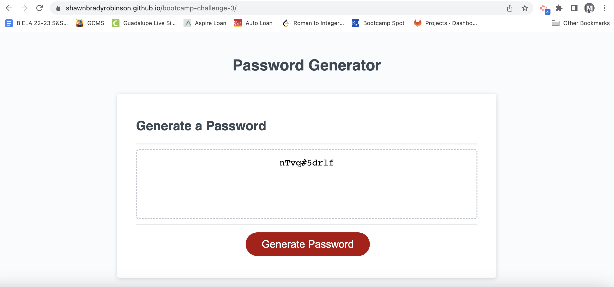

# Bootcamp Challenge 3 - Password Generator 
# Shawn Robinson 

## **Description**
The "Password Generator" application serves as a highly useful tool for any person who wishes to create easy, highly secure passwords for both single-use or extended-use situations. 

The application has a sleek, minimal design, with eye-catching visual cues for interacting with the interface. 

Upon pressing the "Generate Password" button, users will be prompted to choose a password of any length between 8 and 128 characters. 

From there, they are able to select whether they want their password to be comprised of lowercase, uppercase, numerical, or special characters -- as well any combination of these! 

This flexibility allows users to create the perfect password for any and all website, no matter what that site's requirements may be! 

Never stress again about whether or not your pet-name-password is going to be stolen by hackers! Try the "Password Generator" today! 

# Application Link 

Try the "Password Generator" application for yourself at:
https://shawnbradyrobinson.github.io/bootcamp-challenge-3/

## Credits
- Resource I used to check if passwordLength was NaN: 
  https://www.tutorialspoint.com/How-to-check-if-a-variable-is-NaN-in-JavaScript#:~:text=Use%20the%20Number.&text=The%20isNaN()%20method%20checks,always%20returns%20a%20false%20value.

- Resource I used to learn more about using confirm() 
  https://sabe.io/blog/javascript-yes-no-confirmation-box#:~:text=The%20best%20way%20to%20create,Ok%20and%20a%20Cancel%20button.

- Resource I used to learn about generating random numbers:
https://www.w3schools.com/js/js_random.asp

- Resource I used to learn how to shuffle an array:
  https://stackoverflow.com/questions/2450954/how-to-randomize-shuffle-a-javascript-array

- Resource I used to learn how to turn an array into a string without separating commas:  https://herewecode.io/blog/array-to-string-without-commas-javascript/#:~:text=In%20JavaScript%2C%20all%20arrays%20have,all%20the%20array%20elements%20concatenated.

## License

MIT License

Copyright (c) 2023 shawnbradyrobinson

Permission is hereby granted, free of charge, to any person obtaining a copy
of this software and associated documentation files (the "Software"), to deal
in the Software without restriction, including without limitation the rights
to use, copy, modify, merge, publish, distribute, sublicense, and/or sell
copies of the Software, and to permit persons to whom the Software is
furnished to do so, subject to the following conditions:

The above copyright notice and this permission notice shall be included in all
copies or substantial portions of the Software.

THE SOFTWARE IS PROVIDED "AS IS", WITHOUT WARRANTY OF ANY KIND, EXPRESS OR
IMPLIED, INCLUDING BUT NOT LIMITED TO THE WARRANTIES OF MERCHANTABILITY,
FITNESS FOR A PARTICULAR PURPOSE AND NONINFRINGEMENT. IN NO EVENT SHALL THE
AUTHORS OR COPYRIGHT HOLDERS BE LIABLE FOR ANY CLAIM, DAMAGES OR OTHER
LIABILITY, WHETHER IN AN ACTION OF CONTRACT, TORT OR OTHERWISE, ARISING FROM,
OUT OF OR IN CONNECTION WITH THE SOFTWARE OR THE USE OR OTHER DEALINGS IN THE
SOFTWARE.

---